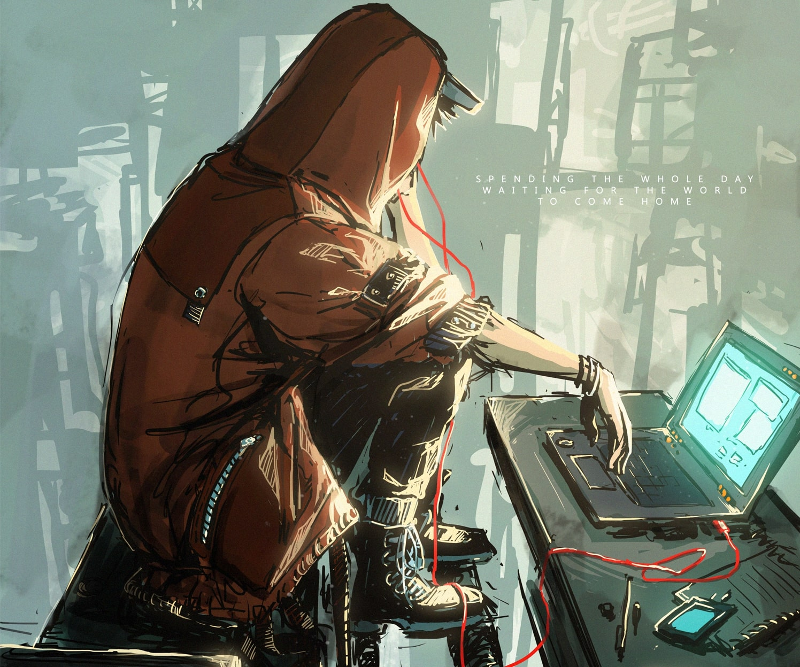

# 👋 Всем Hi, I’m Тимофей.

<h2>Немного обо мне</h2>
<h4>Родной город - Санкт-Петербург</h4>
<h4>В IT - самоучка</h4>

<h2>МК - ONE LOVE❤️</h2>
<h4>Работал с такими устройствами, как:</h4> 
arduino nano, uno, micro, pro mini;

esp(8266, 32);

<h4>А также с голыми камнями</h4>

attiny13, stm32.

#### Работал в таких программах, как arduinoIDE, AVR studio (4, 5 и 7 версии),  CodeBlocks. Также работал c компилятором GCC.
### Мои проекты
#### мини-сервер на esp8266
#### Майнер duino coin-ов на базе esp8266 
#### Стол мини 3d принтера на arduino nano под управлением джойстика.
#### Безмониторные часы на arduino nano, показывающие время "в воздухе", работающие по принципу  вращающихся голографических дисплеев.
#### "голографический" вращающийся дисплей на attiny13. 
### Немного СисАдмин👩‍💻
#### поднял облачное хранилище на ОС debian (OpenMediaVault).
#### знаком с такими серверными инструментами, как: compose,  tailscale, nextcloud, RAID и SMART. Диски и хранилища размечаю вручную.
#### Работал на десятке дистрибутивов linux, в основном базирующихся на debian:
debian, slax, tails, miniOS, OMV, ubuntu и kali а так же arch, android и miui.

 
  
  
  
 

<h2>Мои увлечения👩‍🎤</h2>
<h4>Занимаюсь музыкой: играю на тромбоне и фортепиано.</h4>

<h4>Увлекаюсь настольным теннисом.
</h4>

<h4>ОБОЖАЮ</h4>

<h2>Занимаюсь Йоингом 🪀</h2>

<h2>Я в интернете🤙</h2>
  

    
    
    
  

<h2>А также здесь👋</h2>

 

## Статистика

